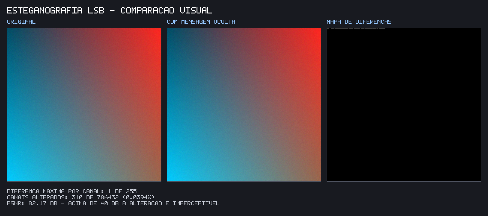
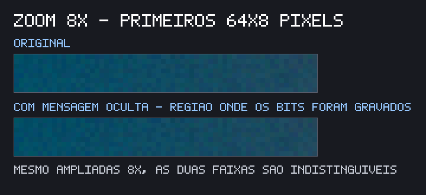

# Relatório — Proteção e Ocultação de Dados

**Disciplina:** CONFIABILIDADE, SEGURANÇA DE SISTEMAS E ERGONOMIA
**Equipe:** Guilherme Savio e João Pedro Francisco
**Data:** 27/09/2026

> **Sobre os resultados apresentados:** todos os blocos de saída deste relatório são a saída real dos scripts, copiada da execução no terminal — não são exemplos ilustrativos. Podem ser reproduzidos com `npm run demo` e `npm test`; `npm run saidas` grava a saída de cada comando em `output/saidas/*.txt`. As figuras da seção 5.4 são geradas por `npm run figuras`.
>
> Como salts, IVs e chaves são aleatórios a cada execução, os valores hexadecimais e em base64 mudam a cada rodada — o que se mantém são as propriedades demonstradas.

---

## 1. Introdução

A segurança da informação costuma ser organizada em torno de três propriedades fundamentais:

- **Confidencialidade** — só quem está autorizado consegue ler o dado. É o que a criptografia garante.
- **Integridade** — é possível detectar se o dado foi alterado no caminho. É o que a auth tag do modo GCM e as funções de hash garantem.
- **Autenticidade** — é possível confirmar que o dado veio de quem diz ter enviado.

Este trabalho implementa três técnicas complementares que atuam sobre essas propriedades:

1. **Hashing com salt**, para que senhas de usuários nunca sejam armazenadas em texto puro;
2. **Criptografia simétrica AES-256-GCM**, para proteger dados financeiros em trânsito com confidencialidade e integridade;
3. **Esteganografia LSB**, para ocultar a própria existência de uma mensagem dentro de uma imagem.

Vale distinguir criptografia de esteganografia: a criptografia torna a mensagem **ilegível**, mas é evidente que existe algo cifrado; a esteganografia torna a mensagem **invisível**, escondendo que há qualquer comunicação. As duas se complementam, como discutido na seção 5.

Todo o código foi escrito em JavaScript puro sobre Node.js 20, usando o módulo nativo `node:crypto` e apenas uma dependência externa (`pngjs`) para manipular imagens.

---

## 2. Ferramentas utilizadas

| Ferramenta | Uso no projeto |
|---|---|
| **Node.js 20+** | Ambiente de execução; ES Modules (`"type": "module"`) |
| **`node:crypto`** | SHA-256, `randomBytes`, `randomUUID`, `scrypt`, AES-256-GCM, `timingSafeEqual` |
| **`pngjs`** | Leitura e escrita de PNG com acesso direto ao buffer RGBA |
| **`node:test` + `node:assert/strict`** | Testes automatizados, sem Jest nem Mocha |
| **`node:util` (`parseArgs`)** | Parsing de argumentos da CLI de esteganografia |
| **Git / GitHub** | Versionamento, com commits organizados por fase |

Nenhum framework foi usado. O "banco de dados" é um arquivo JSON (`data/usuarios.json`), suficiente para o propósito didático.

---

## 3. Módulo 1 — Hashing de senhas

### 3.1 Conceito de função hash

Uma função hash criptográfica transforma uma entrada de tamanho arbitrário em uma saída de tamanho fixo (256 bits no SHA-256) e tem três propriedades relevantes aqui:

- **Unidirecional** — a partir do hash é computacionalmente inviável recuperar a entrada. É isso que permite guardar o hash em vez da senha.
- **Determinística** — a mesma entrada sempre produz a mesma saída, o que torna possível verificar a senha no login.
- **Efeito avalanche** — mudar um único bit da entrada altera aproximadamente metade dos bits da saída, sem qualquer relação aparente com a mudança feita. A demonstração ilustra isso comparando os hashes de `senhaForte123` e `senhaForte124`.

### 3.2 Por que usar salt

Guardar apenas `SHA-256(senha)` tem dois problemas graves:

1. **Rainbow tables.** Como a função é pública e determinística, um atacante pode pré-computar o hash de bilhões de senhas comuns e simplesmente consultar a tabela. Quebrar a senha vira uma busca, não um ataque.
2. **Senhas iguais produzem hashes iguais.** Se dois usuários escolhem a mesma senha, isso fica visível no vazamento: quem quebrar uma, quebra as duas — e ainda descobre quais contas compartilham senha.

O **salt** é um valor aleatório, único por usuário, gravado ao lado do hash (ele não é segredo). O hash passa a ser `SHA-256(salt + senha)`. Com isso, a rainbow table só valeria para um único salt — o atacante precisaria refazer todo o trabalho para cada usuário — e duas senhas iguais passam a gerar hashes completamente diferentes.

### 3.3 Implementação e decisões

Arquivos: `src/hashing/hash.js`, `src/hashing/cadastro.js`, `src/db/bancoSimulado.js`.

- **Salt de 16 bytes (128 bits)** gerado com `crypto.randomBytes`, um gerador criptograficamente seguro. É o tamanho recomendado pela OWASP; a probabilidade de colisão é desprezível.
- **Salt concatenado antes da senha**, de modo que ele já entra no estado interno da função antes de qualquer byte da senha ser processado.
- **Comparação com `crypto.timingSafeEqual`**, não com `===`. O operador `===` para na primeira diferença encontrada, então o tempo de resposta vaza quantos caracteres iniciais estão corretos; com medições repetidas, um atacante poderia reconstruir o valor byte a byte (*timing attack*). O `timingSafeEqual` percorre sempre todos os bytes e gasta o mesmo tempo independentemente de onde está a diferença.
- **Mensagem genérica no login.** Tanto "e-mail não cadastrado" quanto "senha errada" devolvem exatamente `E-mail ou senha inválidos`. Respostas distintas permitiriam a um atacante enumerar quais e-mails existem na base.
- **A senha nunca é persistida nem devolvida.** O registro gravado contém `{ id, nome, email, salt, hash, algoritmo, criadoEm }`; a função de cadastro devolve esse objeto já sem o hash, e a de login devolve o usuário sem hash nem salt.
- **Validações:** campos obrigatórios, mínimo de 8 caracteres e rejeição de e-mail duplicado (normalizado para minúsculas).

### 3.4 Resultados

A demonstração `npm run demo:hash` cadastra dois usuários com a **mesma senha**, exibe o que foi gravado em disco, executa os cenários de login e termina comparando com o que aconteceria sem salt. A saída real da execução está reproduzida abaixo, seção por seção.

#### 3.4.1 Dois usuários, a mesma senha → hashes diferentes

```
Senha usada pelos dois: "senhaForte123"

Ana Souza <ana@exemplo.com>
  salt: f7a6b0b600f91c4f1fbdabf17be1508a
  hash: eb3cb13a5295e27a33946fea4287fb7b9197adaacdbbe696f2e8fd1c4c2f9994

Bruno Lima <bruno@exemplo.com>
  salt: 655cfb6169b30cb03fe7a65329d8eb2d
  hash: e1eac0819ccf77f3f6c0996f44d192e00877b9f27d461007f219a2e9dc5aa3c9

✔ Os hashes são DIFERENTES mesmo com a mesma senha — mérito do salt aleatório.
```

Os dois usuários digitaram exatamente a mesma senha, e mesmo assim os hashes não guardam nenhuma relação entre si — quem olhasse o banco vazado não teria como suspeitar que as senhas coincidem. É o salt fazendo o seu trabalho.

#### 3.4.2 Conteúdo gravado em disco

```json
[
  {
    "id": "89c8efab-1503-4f87-988d-cfdb50b81043",
    "nome": "Ana Souza",
    "email": "ana@exemplo.com",
    "salt": "f7a6b0b600f91c4f1fbdabf17be1508a",
    "hash": "eb3cb13a5295e27a33946fea4287fb7b9197adaacdbbe696f2e8fd1c4c2f9994",
    "algoritmo": "sha256",
    "criadoEm": "2026-09-27T18:58:10.903Z"
  },
  {
    "id": "a6e81227-d18b-461f-8efd-ae2dcf7cca76",
    "nome": "Bruno Lima",
    "email": "bruno@exemplo.com",
    "salt": "655cfb6169b30cb03fe7a65329d8eb2d",
    "hash": "e1eac0819ccf77f3f6c0996f44d192e00877b9f27d461007f219a2e9dc5aa3c9",
    "algoritmo": "sha256",
    "criadoEm": "2026-09-27T18:58:10.911Z"
  }
]
```

```
✔ A senha em texto puro NÃO aparece no arquivo.
```

Este é o requisito central do módulo: não existe campo `senha` no registro, e a busca pela string `senhaForte123` dentro do arquivo não retorna nada.

#### 3.4.3 Login com a senha correta

```
{
  sucesso: true,
  usuario: {
    id: '89c8efab-1503-4f87-988d-cfdb50b81043',
    nome: 'Ana Souza',
    email: 'ana@exemplo.com',
    algoritmo: 'sha256',
    criadoEm: '2026-09-27T18:58:10.903Z'
  }
}
```

Note que o objeto devolvido não traz nem o hash nem o salt.

#### 3.4.4 Login com a senha errada

```
{ sucesso: false, motivo: 'E-mail ou senha inválidos' }

Observação: o mesmo motivo é devolvido para e-mail inexistente:
{ sucesso: false, motivo: 'E-mail ou senha inválidos' }
```

As duas falhas são indistinguíveis para quem está do lado de fora — é o que impede a enumeração de e-mails cadastrados.

#### 3.4.5 Cadastro com e-mail duplicado

```
✔ Erro tratado: Já existe um usuário cadastrado com o e-mail ana@exemplo.com
```

#### 3.4.6 E se não houvesse salt?

```
SHA-256("senhaForte123") sem salt:
  Ana:   d0ad3898fb309b0eb765e6886434ff7d12fa441efc73f25f394d0fd749f71dff
  Bruno: d0ad3898fb309b0eb765e6886434ff7d12fa441efc73f25f394d0fd749f71dff

✘ Hashes IDÊNTICOS: um vazamento revelaria que os dois usam a mesma senha,
  e uma rainbow table quebraria os dois de uma só vez.
```

O contraste com a seção 3.4.1 é a justificativa prática do salt.

#### 3.4.7 Efeito avalanche

```
salt fixo: 95941d9851859e7b00012bc5d7c0129d
hash("senhaForte123") = e44093eaaf00662db2c07b53e84b5a7fb5c67d08e708b1febc694e85798d3738
hash("senhaForte124") = db6f9b382e8c44fd53a11783c2abc0d75feb5fc54a2b6e458cf6e630f241390a

✔ Um único caractere diferente muda o hash inteiro.
```

Mudar o último caractere de `3` para `4` produz um hash sem nenhuma semelhança com o anterior. É essa propriedade que impede deduzir a senha por aproximações sucessivas.

### 3.5 Limitação

**SHA-256 é rápido demais para armazenar senhas.** Ela foi projetada para ser veloz, o que é ótimo para verificar integridade de arquivos e péssimo para senhas: uma GPU moderna calcula bilhões de hashes SHA-256 por segundo, então um ataque de força bruta ou de dicionário sobre um vazamento continua viável mesmo com salt — o salt impede a pré-computação, mas não desacelera o ataque.

O recomendado em produção são funções de derivação **propositalmente lentas e custosas em memória**: **bcrypt**, **scrypt** ou **Argon2** (a preferência atual da OWASP). Elas têm um fator de custo ajustável, de modo que o tempo de verificação siga aceitável para o usuário legítimo (dezenas ou centenas de milissegundos) enquanto o ataque em massa se torna inviável. Neste projeto o scrypt é usado — mas no Módulo 2, para derivar a chave AES a partir de uma senha.

---

## 4. Módulo 2 — Criptografia AES-256-GCM

### 4.1 Simétrica × assimétrica

Na criptografia **simétrica**, a mesma chave cifra e decifra. É rápida e adequada a grandes volumes de dados, mas exige que as duas partes já compartilhem a chave por um canal seguro.

Na **assimétrica** (RSA, ECC), há um par de chaves: a pública cifra, a privada decifra. Resolve o problema da troca de chaves, mas é ordens de grandeza mais lenta e limitada no tamanho do que se pode cifrar.

Na prática usa-se **criptografia híbrida**: a mensagem vai em AES (simétrico) e apenas a chave AES é cifrada com RSA/ECDH (assimétrico). É assim que funciona o TLS.

Escolhemos **AES** por ser o padrão mundial (NIST FIPS 197), estar implementado em hardware nos processadores modernos (instruções AES-NI) e ser a cifra recomendada para proteger dados sensíveis. Usamos chave de **256 bits**, o maior tamanho padronizado.

### 4.2 O modo GCM

Uma cifra de bloco precisa de um **modo de operação** para cifrar mensagens maiores que um bloco. Escolhemos **GCM** (Galois/Counter Mode, NIST SP 800-38D), que é um modo **AEAD** — *Authenticated Encryption with Associated Data*. Ele entrega, de uma vez:

- **Confidencialidade**, transformando o AES em uma cifra de fluxo baseada em contador;
- **Integridade e autenticidade**, através de uma **auth tag** de 128 bits calculada sobre o texto cifrado.

A diferença prática em relação a um modo mais antigo como o CBC é decisiva: no CBC, alterar bytes do texto cifrado produz um texto decifrado corrompido, mas a decifragem "funciona" e cabe à aplicação perceber o problema — o que abre espaço para ataques de *padding oracle*. No GCM, a tag é verificada antes de qualquer saída ser entregue: se um único bit do texto cifrado, do IV ou da própria tag mudar, a operação **falha**.

**IV (vetor de inicialização).** O GCM usa um IV de 96 bits, gerado novo e aleatório a cada cifragem. O IV não é secreto e viaja junto do pacote, mas **nunca pode ser reutilizado com a mesma chave**. Como o GCM é uma cifra de fluxo, duas mensagens cifradas com o mesmo par (chave, IV) usam o mesmo keystream: o XOR dos dois textos cifrados elimina o keystream e revela a relação entre os textos claros. Pior ainda, a reutilização permite recuperar a subchave de autenticação e **forjar mensagens com tag válida**, destruindo também a integridade.

**Derivação de chave com scrypt.** Uma senha digitada por uma pessoa não tem 256 bits de entropia nem o tamanho certo para virar chave AES. `crypto.scryptSync(senha, salt, 32)` converte a senha em uma chave de 32 bytes através de uma função lenta e custosa em memória, encarecendo muito um ataque de força bruta sobre a senha. O salt da derivação é aleatório e é transmitido dentro do pacote — sem ele o destinatário não consegue derivar a mesma chave.

### 4.3 Implementação

Arquivo: `src/criptografia/aes.js`.

O pacote produzido por `cifrar()` tem a forma:

```json
{
  "algoritmo": "aes-256-gcm",
  "iv": "<12 bytes em base64>",
  "authTag": "<16 bytes em base64>",
  "textoCifrado": "<base64>",
  "salt": "<salt da derivação, em base64>"
}
```

Os binários vão em base64 para que o pacote inteiro seja um JSON transportável como texto. A função `decifrar()` captura qualquer falha do GCM e a relança como `Falha na decifragem: chave incorreta ou dados adulterados` — mensagem propositalmente genérica, para não informar a um atacante se o que falhou foi a chave ou a integridade.

A demonstração (`scripts/demo-criptografia.js`) simula remetente e destinatário no mesmo computador, usando `output/mensagem.enc.json` como "canal". Os dados financeiros são fictícios; o número de cartão `4111 1111 1111 1111` é o número público de testes da Visa.

### 4.4 Resultados

A demonstração `npm run demo:cripto` percorre o caminho completo — remetente, canal, destinatário — e termina com três cenários de falha: senha errada, 1 byte do texto cifrado invertido e auth tag alterada. A saída real da execução está reproduzida abaixo, seção por seção.

#### 4.4.1 Dados a proteger

```json
{
  "titular": "Maria Exemplo",
  "banco": "Banco Fictício S.A.",
  "agencia": "0001",
  "conta": "12345-6",
  "saldo": 15320.5,
  "cartao": "4111 1111 1111 1111",
  "ultimaTransacao": {
    "valor": -289.9,
    "descricao": "Supermercado",
    "data": "2026-09-20"
  }
}
```

#### 4.4.2 Remetente — derivação da chave e cifragem

```
Senha combinada: "combinamos-essa-senha-no-cafe"
Salt da derivação (aleatório): b333fe97cbfaa277d9d40187dc681401
Chave derivada (scrypt, 32 bytes): cb682828ff052269280d6007cb347431cf1844e076c72b66ef07f2afd10e0b58

Pacote gravado em output\mensagem.enc.json
```

A senha legível de 29 caracteres vira uma chave de 256 bits indistinguível de ruído.

#### 4.4.3 O que trafega pelo canal

```json
{
  "algoritmo": "aes-256-gcm",
  "iv": "x+eQ+glB7T/N1ap2",
  "authTag": "Muib+v9lpdTPD4PrStDivg==",
  "textoCifrado": "/UggJqcYLRRFE5itAC3yTJ3nP2Z1qr+UBaosTm8QpUQk27YZONsAfkoJ3AYkb6n+5NzMaKP6lJHl7LLxJfvXI+jMV5z2H1XgTK98O+BC8CDSXyuf353jF44EZvTlDHJa3ZxnqeCdYjHPLGobiG3/TWHSgVSu3z1fgZ9AKDHUVlr9glvCDRbKVdTPVaf2C3uBRXlie2+PEjPZriJMX8UjFePb2b3z/ySaOT1vcGgLjvv4LIIBCiVbK93VuLgiDsCv2otpQU5IVXpSMKUayzOnOV1mTk6mj6EFewERfC3VzrO2znhvqz0cQRcFErFwdTTcIAvnzIA9JYeLCCKszlK7qmAke8iTq4wIXjcT5LAxpn8=",
  "salt": "szP+l8v6onfZ1AGH3GgUAQ=="
}
```

```
✔ Nenhum dado financeiro é reconhecível no texto cifrado.
✔ "4111" aparece no texto cifrado? não
```

Quem interceptar o arquivo não encontra nem o nome do titular, nem o saldo, nem qualquer fragmento do número do cartão.

#### 4.4.4 Destinatário — decifragem com a chave correta

```
Chave derivada pelo destinatário: cb682828ff052269280d6007cb347431cf1844e076c72b66ef07f2afd10e0b58
Chaves iguais? sim (mesma senha + mesmo salt)
```

```json
{
  "titular": "Maria Exemplo",
  "banco": "Banco Fictício S.A.",
  "agencia": "0001",
  "conta": "12345-6",
  "saldo": 15320.5,
  "cartao": "4111 1111 1111 1111",
  "ultimaTransacao": {
    "valor": -289.9,
    "descricao": "Supermercado",
    "data": "2026-09-20"
  }
}
```

```
✔ Texto original recuperado
```

Esta é a **função reversa** exigida pela atividade: o destinatário chegou à mesma chave partindo da senha combinada e do salt que veio no pacote, e recuperou o texto byte a byte (conferido com `assert` no script).

#### 4.4.5 Tentativa com a senha errada

```
✔ Erro capturado: Falha na decifragem: chave incorreta ou dados adulterados
```

#### 4.4.6 Adulteração de 1 byte no texto cifrado

```
Byte 0 antes:  253
Byte 0 depois: 252
✔ Integridade violada e detectada pelo GCM: Falha na decifragem: chave incorreta ou dados adulterados
```

Um único bit invertido em um pacote de 256 bytes já é suficiente para a auth tag não fechar. A decifragem **falha**, em vez de devolver um texto corrompido — é exatamente a diferença entre o GCM e um modo sem autenticação como o CBC.

#### 4.4.7 Adulteração da auth tag

```
✔ Erro capturado: Falha na decifragem: chave incorreta ou dados adulterados
```

Nem adulterar a própria tag ajuda: ela é verificada contra o texto cifrado, não isoladamente.

### 4.5 Limitação

**A troca da chave é o ponto frágil.** Toda a segurança depende de remetente e destinatário compartilharem a senha por um canal seguro — e combinar uma senha pessoalmente não escala para milhões de usuários.

A solução real é a **criptografia híbrida**: gera-se uma chave AES aleatória para cada mensagem (chave de sessão), cifra-se a mensagem com ela e cifra-se **apenas a chave** com a chave pública RSA do destinatário (RSA-OAEP), ou negocia-se a chave com **ECDH**. Assim, ninguém precisa combinar segredo nenhum antecipadamente. É exatamente o que o TLS faz em cada conexão HTTPS. Essa extensão está listada como item opcional no plano do projeto.

Uma segunda limitação: o AES-GCM protege a mensagem, mas não esconde que houve comunicação, nem o tamanho aproximado dos dados. É aí que entra o Módulo 3.

---

## 5. Módulo 3 — Esteganografia LSB

### 5.1 Conceito

Esteganografia é a arte de esconder a **existência** da mensagem. A técnica **LSB** (*Least Significant Bit*) explora o fato de que, numa imagem, cada canal de cor de um pixel é um byte de 0 a 255, e o bit menos significativo desse byte contribui com apenas **1 unidade** no valor final.

Trocar esse bit muda, por exemplo, um vermelho de valor 182 para 183 — uma variação de menos de 0,4% em um único canal, que o olho humano não distingue, ainda mais espalhada por pixels isolados. Usando os canais R, G e B, escondem-se **3 bits por pixel**.

O canal **alfa (transparência) não é alterado**: mexer nele pode produzir artefatos visíveis, e alguns editores normalizam ou descartam o alfa, o que corromperia a mensagem.

### 5.2 Protocolo de gravação

Escrever só os bytes da mensagem não basta — na extração é preciso saber se há mensagem e onde ela termina. O formato implementado grava, em ordem:

| Campo | Tamanho | Função |
|---|---|---|
| Assinatura `STG1` | 4 bytes | Identifica que a imagem contém mensagem neste formato |
| Tamanho | 4 bytes (uint32 big-endian) | Quantos bytes de mensagem ler em seguida |
| Mensagem | N bytes | Texto em UTF-8 |

Cada byte é gravado bit a bit, do mais significativo para o menos significativo, em `novoValor = (valor & 0xFE) | bit`, percorrendo os canais R, G e B em sequência e pulando o alfa.

Na extração, lê-se primeiro o cabeçalho de 8 bytes. Se a assinatura não for `STG1`, a função lança `Nenhuma mensagem oculta encontrada` — é o que acontece ao tentar extrair de uma imagem comum. Em seguida o tamanho é validado contra a capacidade da imagem antes de qualquer leitura, evitando que um cabeçalho corrompido peça uma leitura absurda.

**Capacidade:**

```
capacidade_em_bytes = floor(largura × altura × 3 / 8) − 8
```

Para a imagem de 512×512 usada na demonstração: `floor(512 × 512 × 3 / 8) − 8 = 98.296 bytes`, cerca de 96 KB de texto — mais de 40 páginas. A mensagem da demonstração ocupa 65 bytes, ou **0,066%** da capacidade.

### 5.3 Implementação

Arquivos: `src/esteganografia/lsb.js` (ocultar/extrair, com as funções puras `bytesParaBits`, `bitsParaBytes`, `escreverBits` e `lerBits` separadas para permitir testes unitários) e `src/esteganografia/metricas.js` (comparação e mapa de diferenças).

A saída **precisa ser PNG**, e a biblioteca recusa qualquer outra extensão. PNG usa compressão sem perdas, preservando os bytes dos pixels exatamente. Um JPEG recalcularia os pixels via DCT e quantização, destruindo justamente os bits menos significativos e apagando a mensagem.

### 5.4 Resultados

Medidas obtidas com `npm run demo:esteg` sobre a imagem de 512×512, ocultando a frase *"Reunião confidencial: servidor de backup migra na sexta às 22h."* (65 bytes):

| Métrica | Valor |
|---|---|
| Canais comparados | 786.432 |
| Canais alterados | 310 (0,0394%) |
| Diferença máxima por canal | **1** (de 255) |
| MSE | 3,94 × 10⁻⁴ |
| **PSNR** | **82,17 dB** |
| Canal alfa | intacto |

O **PSNR** (*Peak Signal-to-Noise Ratio*) mede a razão entre o sinal máximo e o ruído introduzido, em escala logarítmica: `PSNR = 10 × log10(255² / MSE)`. Na literatura de processamento de imagens, valores acima de 40 dB já indicam degradação imperceptível; os **82 dB** obtidos estão muito acima disso, confirmando numericamente que a alteração é invisível.

Note que apenas 310 canais foram alterados, e não os 584 que receberam gravação (8 bytes de cabeçalho + 65 da mensagem = 73 bytes × 8 bits). A razão é que um bit só altera o pixel quando difere do que já estava lá: como os bits menos significativos de uma imagem com ruído são aproximadamente aleatórios, em média **metade** das gravações não muda valor nenhum — de fato, 310/584 = 53%.

O **mapa de diferenças** (`output/mapa-diferencas.png`) marca em branco os pixels que tiveram algum canal alterado. Como a gravação é sequencial a partir do primeiro pixel, os pontos brancos ficam concentrados no canto superior esquerdo — e apenas 173 dos 262.144 pixels aparecem.

A saída real da execução de `npm run demo:esteg` está reproduzida abaixo, seção por seção.

#### 5.4.1 Imagem portadora

```
Dimensões:  512 x 512 pixels
Canais RGB: 786432 (1 bit oculto em cada)
Capacidade: 98296 bytes (~96.0 KB de texto)
```

#### 5.4.2 Ocultando a mensagem

```
Mensagem: "Reunião confidencial: servidor de backup migra na sexta às 22h."
Tamanho em UTF-8: 65 bytes
Ocupação da capacidade: 0.0661%
Imagem gerada: output\imagem-com-segredo.png
```

A frase tem 63 caracteres mas ocupa 65 bytes: `ã` e `à` usam 2 bytes cada em UTF-8. É por isso que o protocolo grava o tamanho em **bytes**, e não em caracteres.

#### 5.4.3 Impacto visual

```
Canais comparados:   786432
Canais alterados:    310 (0.0394%)
Diferença máxima:    1 (de 255 possíveis)
MSE:                 3.942e-4
PSNR:                82.17 dB
Canal alfa intacto:  sim

✔ Nenhum canal variou mais que 1 unidade e o alfa ficou intacto.
✔ PSNR acima de 50 dB: a alteração é visualmente imperceptível.
```

#### 5.4.4 Mapa de diferenças

```
Arquivo gerado: output\mapa-diferencas.png
Pixels com algum canal alterado: 173 de 262144 (0.0660%)
Os pixels brancos, no canto superior esquerdo, são onde a mensagem foi gravada.
```

#### 5.4.5 Extraindo a mensagem da imagem alterada

```
Mensagem recuperada: "Reunião confidencial: servidor de backup migra na sexta às 22h."

✔ Mensagem idêntica à original
```

A varredura da imagem alterada recuperou a frase completa, com acentos preservados — o segundo requisito do módulo.

#### 5.4.6 Tentando extrair da imagem original

```
✔ Erro esperado: Nenhuma mensagem oculta encontrada
```

A assinatura `STG1` não foi encontrada no cabeçalho, então a função recusa a leitura em vez de devolver bytes aleatórios interpretados como texto.

#### 5.4.7 Comparação visual

**Figura 1 — Comparação visual.** À esquerda a imagem original, ao centro a mesma imagem com os 65 bytes ocultos e à direita o mapa de diferenças. As duas primeiras são indistinguíveis a olho nu; no mapa, a faixa branca no topo revela onde os bits foram gravados. Gerada por `npm run figuras`.



**Figura 2 — Ampliação 8×.** Os primeiros 64 × 8 pixels das duas imagens, justamente a região onde a mensagem foi gravada, ampliados oito vezes. Mesmo nessa escala nenhuma diferença é perceptível — coerente com a variação máxima de 1 unidade em 255 por canal.



### 5.5 Limitações

- **Fragilidade a transformações.** Qualquer operação que recalcule os pixels destrói a mensagem: salvar como JPEG, redimensionar, aplicar filtros, ajustar brilho ou até recortar a imagem. O portador precisa chegar ao destino byte a byte idêntico.
- **Detectável por esteganálise.** Embora invisível ao olho, o LSB clássico é detectável estatisticamente. Os bits menos significativos de uma imagem natural têm correlações próprias; substituí-los por dados de texto — que são longe de aleatórios — altera essa distribuição de forma mensurável por técnicas como a análise de pares de valores (*chi-square attack*) ou RS analysis.
- **Sem cifragem, a mensagem está em claro.** Quem descobrir o formato simplesmente lê o texto. **A combinação com o Módulo 2 resolve os dois últimos pontos de uma vez:** cifrar a frase com AES-256-GCM antes de ocultá-la faz com que os bits gravados sejam indistinguíveis de ruído aleatório (dificultando a esteganálise) e garante que, mesmo se extraídos, não revelem nada sem a chave. Essa combinação está listada como extra opcional no plano do projeto.
- **Capacidade limitada.** Cabe 1 bit por canal; esconder arquivos grandes exigiria imagens muito grandes, e aumentar a taxa (usar 2 ou mais bits por canal) tornaria a alteração visível e a detecção trivial.

---

## 6. Testes automatizados

Os testes usam o executor nativo `node:test` com `node:assert/strict`, sem dependências externas. São **49 casos** distribuídos em três arquivos:

**`test/hashing.test.js`** — unicidade e formato do salt (32 caracteres hex); determinismo do hash; hashes diferentes com salts diferentes; aceitação e rejeição em `compararHash`, inclusive com hash de tamanho inválido; ausência da senha em texto puro no arquivo gravado; cadastro que não devolve hash nem senha; rejeição de e-mail duplicado, senha curta e campos ausentes; salts e hashes distintos para a mesma senha; login correto; mensagem genérica idêntica para senha errada e usuário inexistente.

**`test/criptografia.test.js`** — ida e volta preservando acentos e emojis, texto vazio e texto de 100 mil caracteres; formato do pacote (IV de 12 bytes, tag de 16); textos cifrados diferentes a cada chamada por causa do IV aleatório; erro com chave errada, com texto cifrado adulterado, com auth tag adulterada e com IV adulterado; rejeição de chave com tamanho inválido e de pacote incompleto; ausência do texto original dentro do texto cifrado.

**`test/esteganografia.test.js`** — funções puras de conversão bits/bytes, inclusive a ordem MSB; gravação e leitura pulando o canal alfa; fórmula da capacidade; ida e volta com acentos e emoji; mensagem exatamente no limite da capacidade; diferença máxima de 1 por canal e PSNR acima de 50 dB; canal alfa intacto; erro para mensagem maior que a capacidade, para imagem sem mensagem, para saída que não é `.png` e para mensagem vazia; imagem original preservada no disco; regravação sobrescrevendo a mensagem anterior; geração e conferência do mapa de diferenças; recusa de imagens com dimensões diferentes e PSNR infinito para imagens idênticas.

Os testes que precisam de disco usam arquivos temporários em `os.tmpdir()`, de modo que não interferem no banco nem nas imagens da demonstração.

### 6.1 Saída da execução

```
$ npm test

✔ gerarChaveAleatoria devolve 32 bytes distintos a cada chamada (1.7311ms)
✔ derivarChave é determinística para a mesma senha e salt (88.7218ms)
✔ derivarChave produz chaves diferentes com salts diferentes (82.4052ms)
✔ ida e volta recupera o texto exato, com acentos e emojis (1.0595ms)
✔ ida e volta funciona com texto vazio e com texto longo (1.3195ms)
✔ o pacote tem o formato esperado (0.3413ms)
✔ duas cifragens do mesmo texto com a mesma chave geram saídas diferentes (IV aleatório) (0.4649ms)
✔ chave errada lança erro (0.5264ms)
✔ texto cifrado adulterado lança erro (0.4095ms)
✔ auth tag adulterada lança erro (0.3653ms)
✔ IV adulterado lança erro (0.263ms)
✔ cifrar rejeita chave de tamanho inválido e entrada não textual (0.1924ms)
✔ decifrar rejeita pacote incompleto ou com algoritmo desconhecido (0.2499ms)
✔ o texto cifrado não contém o texto original em claro (0.2895ms)
✔ bytesParaBits e bitsParaBytes são inversos (1.5684ms)
✔ bytesParaBits usa o bit mais significativo primeiro (0.2336ms)
✔ bitsParaBytes rejeita quantidade que não é múltipla de 8 (0.3355ms)
✔ escreverBits e lerBits pulam o canal alfa (0.2039ms)
✔ lerBits respeita o deslocamento inicial (0.2089ms)
✔ capacidade segue a fórmula largura x altura x 3 / 8 - cabeçalho (1.92ms)
✔ ida e volta recupera a mensagem exata, com acentos e emoji (16.846ms)
✔ mensagem no limite exato da capacidade funciona (5.8573ms)
✔ nenhum canal difere em mais de 1 entre a original e a alterada (7.6116ms)
✔ o canal alfa permanece intacto (7.5089ms)
✔ mensagem maior que a capacidade lança erro (2.7718ms)
✔ imagem sem mensagem lança erro na extração (2.8989ms)
✔ contemMensagem identifica a imagem alterada (10.0343ms)
✔ saída que não é .png é recusada (2.2228ms)
✔ mensagem vazia é recusada (1.2489ms)
✔ a imagem original não é modificada no disco (2.7861ms)
✔ ocultar duas vezes sobrescreve a mensagem anterior (5.763ms)
✔ gerarMapaDiferencas produz um PNG com os pixels alterados em branco (6.5855ms)
✔ compararImagens recusa dimensões diferentes (3.1119ms)
✔ compararImagens devolve PSNR infinito para imagens idênticas (3.9147ms)
✔ gerarSalt produz valores diferentes a cada chamada (3.4089ms)
✔ gerarSalt(16) devolve 32 caracteres hexadecimais (0.2456ms)
✔ mesma senha e mesmo salt produzem o mesmo hash (determinismo) (0.6295ms)
✔ mesma senha com salts diferentes produz hashes diferentes (0.1864ms)
✔ gerarHash devolve 64 caracteres hexadecimais (SHA-256) (0.1777ms)
✔ compararHash aceita a senha correta e rejeita a incorreta (0.2486ms)
✔ compararHash devolve false para hash armazenado de tamanho inválido (0.148ms)
✔ o arquivo do banco não contém a senha em texto puro (9.7876ms)
✔ cadastrarUsuario não devolve hash nem senha (1.4986ms)
✔ cadastro com e-mail duplicado lança erro (9.1011ms)
✔ cadastro rejeita senha curta e campos obrigatórios ausentes (0.7258ms)
✔ dois usuários com a mesma senha têm salts e hashes diferentes (15.3083ms)
✔ autenticarUsuario funciona com a senha correta (6.5634ms)
✔ autenticarUsuario usa o mesmo motivo para senha errada e usuário inexistente (8.8517ms)
✔ lerUsuarios devolve array vazio quando o arquivo não existe (0.8449ms)

ℹ tests 49
ℹ suites 0
ℹ pass 49
ℹ fail 0
ℹ cancelled 0
ℹ skipped 0
ℹ todo 0
ℹ duration_ms 265.583
```

Os 49 casos passam em menos de 0,3 segundo, sem nenhuma dependência de teste externa.

---

## 7. Conclusão

O trabalho implementou e demonstrou três técnicas que atacam problemas distintos de segurança da informação.

O **hashing com salt** mostrou que armazenar senhas de forma segura não é apenas "aplicar um hash": sem salt, dois usuários com a mesma senha ficam expostos juntos e rainbow tables tornam o ataque trivial. Também ficou claro que detalhes de implementação importam — a comparação em tempo constante e a mensagem de erro genérica no login são decisões que não afetam o funcionamento visível do sistema, mas fecham vetores reais de ataque.

A **criptografia AES-256-GCM** evidenciou a diferença entre apenas cifrar e cifrar com autenticação: a alteração de um único bit foi detectada e rejeitada, em vez de produzir silenciosamente um texto corrompido. A necessidade de um IV novo a cada operação e de uma derivação de chave adequada mostrou que a escolha do algoritmo é só parte do problema — o modo de operação e o gerenciamento das chaves pesam tanto quanto.

A **esteganografia LSB** demonstrou uma abordagem complementar: em vez de proteger o conteúdo, esconder a existência da comunicação. As métricas confirmaram numericamente a imperceptibilidade (diferença máxima de 1 por canal, PSNR de 82 dB), e as limitações levantadas — fragilidade a recompressão e detectabilidade por esteganálise — reforçam que a esteganografia é uma camada adicional, não um substituto da criptografia.

A conclusão mais ampla é que essas técnicas se complementam e que segurança se constrói em camadas: o cenário mais robusto seria cifrar a mensagem com AES-GCM, ocultar o resultado em uma imagem por LSB e proteger as credenciais de acesso com uma função de derivação lenta como Argon2.

---

## 8. Referências

1. **Node.js.** *Crypto — Node.js v20 Documentation.* Disponível em: https://nodejs.org/api/crypto.html
2. **NIST.** *FIPS PUB 197: Advanced Encryption Standard (AES).* National Institute of Standards and Technology, 2001 (atualizado em 2023). https://csrc.nist.gov/pubs/fips/197/final
3. **NIST.** *SP 800-38D: Recommendation for Block Cipher Modes of Operation — Galois/Counter Mode (GCM) and GMAC.* 2007. https://csrc.nist.gov/pubs/sp/800/38/d/final
4. **NIST.** *FIPS PUB 180-4: Secure Hash Standard (SHS).* 2015. https://csrc.nist.gov/pubs/fips/180-4/upd1/final
5. **OWASP.** *Password Storage Cheat Sheet.* https://cheatsheetseries.owasp.org/cheatsheets/Password_Storage_Cheat_Sheet.html
6. **PERCIVAL, C.; JOSEFSSON, S.** *RFC 7914: The scrypt Password-Based Key Derivation Function.* IETF, 2016. https://www.rfc-editor.org/rfc/rfc7914
7. **FRIDRICH, J.; GOLJAN, M.; DU, R.** *Detecting LSB Steganography in Color and Gray-Scale Images.* IEEE Multimedia, v. 8, n. 4, 2001.
8. **pngjs.** Biblioteca de leitura/escrita de PNG para Node.js. https://www.npmjs.com/package/pngjs

---

## 9. Repositório

Código-fonte completo: **https://github.com/LadonGx/Atividade3-Criptografia**

Histórico de commits organizado por fase:

```
chore: estrutura inicial do projeto
feat: módulo de hashing com salt
feat: módulo de criptografia AES-256-GCM
feat: módulo de esteganografia LSB
docs: README e rascunho do relatório
```
